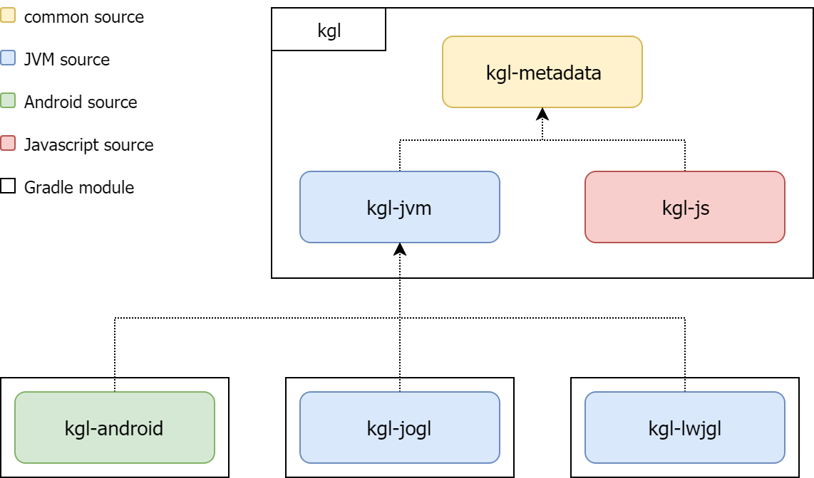

# Kgl - Kotlin Multiplatform OpenGL abstraction

This is an OpenGL wrapper library for Kotlin Multiplatform. The following target platforms are supported: Android, Web, Desktop.

**Note: this library is a work-in-progress, the set of functions is incomplete.** I used it for my multiplatform game [Skyway](https://skyway.danielgergely.com).
Despite it not being ready I can still recommend using it, since it's designed to be as thin a layer as possible, it might be a good start for other projects as well, it's easy to extend and troubleshoot if necessary. 

## Project structure
The projects is separated into the following parts:



The following artifacts can be imported:

|Artifact       |Role                                                                                                                           |
|---------------|-------------------------------------------------------------------------------------------------------------------------------|
|kgl-metadata   |The Kgl interface itself with multiplatform (expect) types. Use this in your common source set.                                |
|kgl-js         |The Javascript/WebGL implementation of the interface. Use this in your JS source set.                                          |
|kgl-jvm        |The Kgl interface with actual JVM types. This is added for extendability, use this to add support for any JVM OpenGL wrapper   |
|kgl-android    |Android library (AAR) containing the implementation of Kgl adapter for `android.opengl.GLES20`. Use it on your Android app     |
|kgl-jogl       |Kgl adapter for `com.jogamp.opengl.GL3ES3`. Use this in your JOGL application module.                                          |
|kgl-lwjgl      |Kgl adapter for `org.lwjgl.opengl.GL33`. Use this in your LWJGL application module.                                            |


## Install

Since the project is in alpha stage, it is only available from my own maven repository:
```groovy
maven { url 'https://maven.danielgergely.com/repository/releases' }

implementation "com.danielgergely.kgl:kgl-metadata:0.2"
```

## Build
Use `gradlew build` command to build project.

Use `gradlew publish` command to publish to the Maven repository - note: environment variables must be set accordingly.
